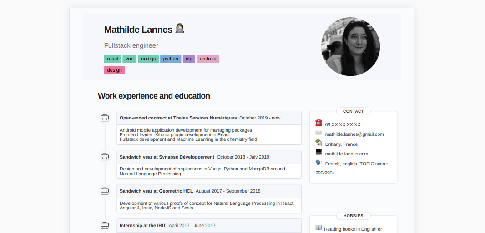

<div style="text-align:center">
    <h1> ✍️ Resume generator </h1>

    Quickly update a resume and handle multiple languages.
</div>





## 🚀 Quickstart

```bash
cd my-cv
# install dependencies
npm i
# run the app
npm start
```

> 💡 To have a better preview of the PDF result, go to the DevTools > Toggle device toolbar > Choose iPad Pro


## 💾 Save to PDF

1. Right-click on the page > `Print...`
2. Destination : Save as PDF
3. More settings :
    - Paper size : A4
    - Margins : None
    - Scale : Custom / 84
    - Options : check "Background graphics"